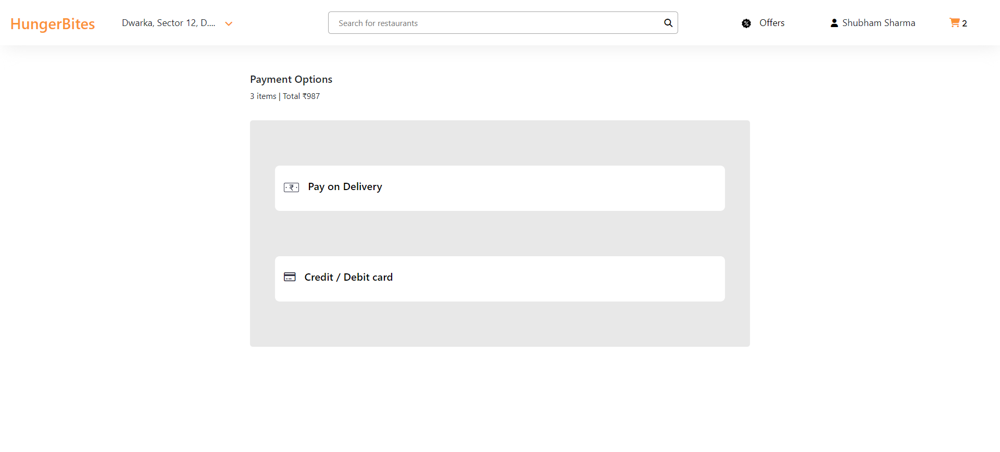

# FoodPoint - Food Ordering Web Application

FoodPoint is an ambitious and dynamic food ordering web application that aims to redefine the dining experience for users. This project is currently in progress, showcasing a range of exciting features and functionalities, with ongoing development efforts focused on enhancing its capabilities.

## Project Status
FoodPoint is an ongoing project with exciting features and enhancements in development. Stay tuned for updates and improvements.

## Features

- **Restaurant Discovery**: Leveraging the Swiggy API, FoodPoint enables users to search for a wide variety of restaurants, giving them a vast selection of culinary options to choose from.

- **Menu Customization**: Users can curate their own culinary journey by selecting different food items, adding them to their virtual cart, and dynamically adjusting quantities to suit their preferences.

- **Secure Payments**:FoodPoint provides users with the convenience of making payments through credit/debit cards while also offering Cash-on-Delivery (COD) as an alternative payment method.

- **Geolocation Services**: The application integrates OpenStreetMap's API to empower users to pinpoint their current location, enhancing their overall experience by tailoring restaurant recommendations and delivery options based on their proximity.

- **User Authentication**: FoodPoint ensures data security and personalized experiences by implementing user login and logout features, ensuring a secure and user-friendly environment.

- **AI-Powered Food Recommendations**: The project is set to incorporate OpenAI's advanced AI capabilities, enabling users to engage with a ChatGPT-like feature for personalized food suggestions, making the dining experience truly unique and user-centric.
  
- **Advanced Dish Filtering**: In the pipeline is the addition of advanced dish filtering options, including dietary preferences such as vegetarian, non-vegetarian, vegan, diabetic-friendly, protein-rich, and seafood, providing users with an enhanced ability to find dishes that align with their specific tastes and dietary requirements.

## Getting Started

To get started with FoodPoint, follow these steps:

1. **Clone the Repository**:
   ```bash
   git clone https://github.com/dikshajaggi/practice.git


## Available Scripts

In the project directory, you can run:

### `npm start`

Runs the app in the development mode.\
Open [http://localhost:3000](http://localhost:3000) to view it in your browser.

The page will reload when you make changes.\


## Screenshots

Here are some screenshots of the FoodPoint application:

### Home Page

*Description: The main landing page with location services enabled for current or delivery location.*

### Main Restaurant Page

*Description: The page where users can browse and discover all available restaurants.*

### Restaurant Page

*Description: A specific restaurant's page, allowing users to explore the restaurant's menu, view dish details, and add items to their cart.*

### Cart Page
!Cart Page](./screenshots/cart_page.png)
*Description: The cart page provides an overview of all items added by the user, where they can review, adjust quantities, and proceed to checkout.*

### Payment Page

*Description: The payment page where users can complete their order, select payment options, and finalize the transaction for a seamless dining experience.*

### Favorites Page

*Description: The favorites page, allowing users to manage and view their list of preferred restaurants, making future orders even more convenient.*

### Login Page

*Description: The login page, where users can securely log in to their accounts to access personalized features and saved information.*

### Signup Page

*Description: The signup page for new users to create accounts and join the FoodPoint community, gaining access to exclusive benefits.*

### Offers Page

*Description: The offers page displays the latest discounts, promotions, and special deals from participating restaurants, providing users with enticing savings on their orders.*

### About Us Page

*Description: The "About Us" page provides information about FoodPoint, including its vision, and the team behind the project. Users can get to know the platform better and the people who make it all happen.*


